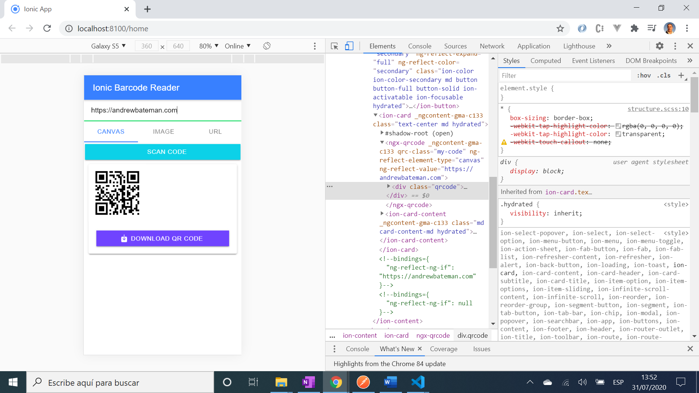

# :zap: Ionic Angular QR Bar Code Reader

* App created using the [Ionic 5 framework](https://ionicframework.com/docs) to use the [Angular component ngx-qrcode2: Quick Response bar code reader](https://www.npmjs.com/package/ngx-qrcode2). Another great tutorial from [Ionic Academy](https://ionicacademy.com/how-to-ion-picker-component/) **code updated to the latest QR bar code scanner version**.

## :page_facing_up: Table of contents

* [:zap: Ionic Angular QR Bar Code Reader](#zap-ionic-angular-qr-bar-code-reader)
  * [:page_facing_up: Table of contents](#page_facing_up-table-of-contents)
  * [:books: General info](#books-general-info)
  * [:camera: Screenshots](#camera-screenshots)
  * [:signal_strength: Technologies](#signal_strength-technologies)
  * [:floppy_disk: Setup](#floppy_disk-setup)
  * [:computer: Code Examples](#computer-code-examples)
  * [:cool: Features](#cool-features)
  * [:clipboard: Status & To-do list](#clipboard-status--to-do-list)
  * [:clap: Inspiration](#clap-inspiration)
  * [:envelope: Contact](#envelope-contact)

## :books: General info

* Generates QR bar codes from input text (a web address in this case) as the text is typed.

## :camera: Screenshots



## :signal_strength: Technologies

* [Ionic v5](https://ionicframework.com/)
* [Angular v10](https://angular.io/)
* [Ionic/angular v5](https://www.npmjs.com/package/@ionic/angular)
* [Angular bar code reader component library ngx-qrcode2 v9](https://www.npmjs.com/package/ngx-qrcode2)
* [Angular Reactive Extensions for JS, rxjs](https://angular.io/guide/rx-library) async function used to show a user message toast upon successful scan save operation (or error message if not).

* [Cordova Plugin: base64-to-gallery](https://ionicframework.com/docs/native/base64-to-gallery) to save base 64 data as a device png image
* [Ionic Plugin: native bar code scanner](https://ionicframework.com/docs/native/barcode-scanner) opens the camera view and scans a bar code automatically with data returned

## :floppy_disk: Setup

* To start the server on _localhost://8100_ type: 'ionic serve'

## :computer: Code Examples

* function to download bar code data.

```typescript
 downloadQR() {
    const canvas = document.querySelector('canvas') as HTMLCanvasElement;
    const imageData = canvas.toDataURL('image/jpeg').toString();
    console.log('data: ', imageData);

    let data = imageData.split(',')[1];

    this.base64ToGallery.base64ToGallery(data,
      { prefix: '_img', mediaScanner: true })
      .then(async res => {
        let toast = await this.toastCtrl.create({
          header: 'QR code saved to Photolibrary'
        });
        toast.present();
    }, err => console.log('err: ', err))
  };
```

## :cool: Features

* Uses phone camera to scan a bar code.
* saves bar code images to phone photo library.

## :clipboard: Status & To-do list

* Status: Working
* To-do: Test in Android Studio

## :clap: Inspiration

* Project inspired by [Simon Grimm´s Youtube video: How to Read and Create QR Codes with Ionic 4](https://www.youtube.com/watch?v=iDYJ8YfdUTU&t=269s)
* [Github repo: @techiediaries/ngx-qrcode](https://github.com/techiediaries/ngx-qrcode#how-to-use-ngx-qrcode2)
* [Techiediaries: Tutorial: Create a QR Code Generator with Angular 4+](https://www.techiediaries.com/generate-qrcodes-angular/)

## :envelope: Contact

* Repo created by [ABateman](https://www.andrewbateman.org) - you are welcome to [send me a message](https://andrewbateman.org/contact)
